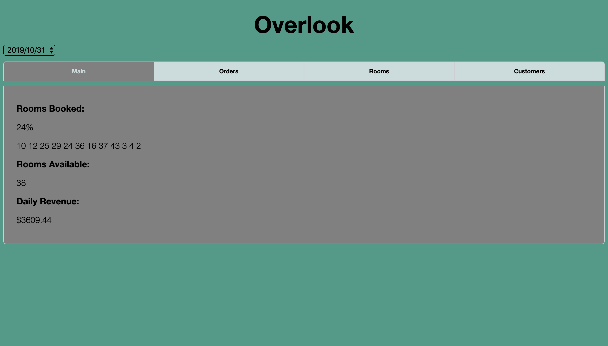
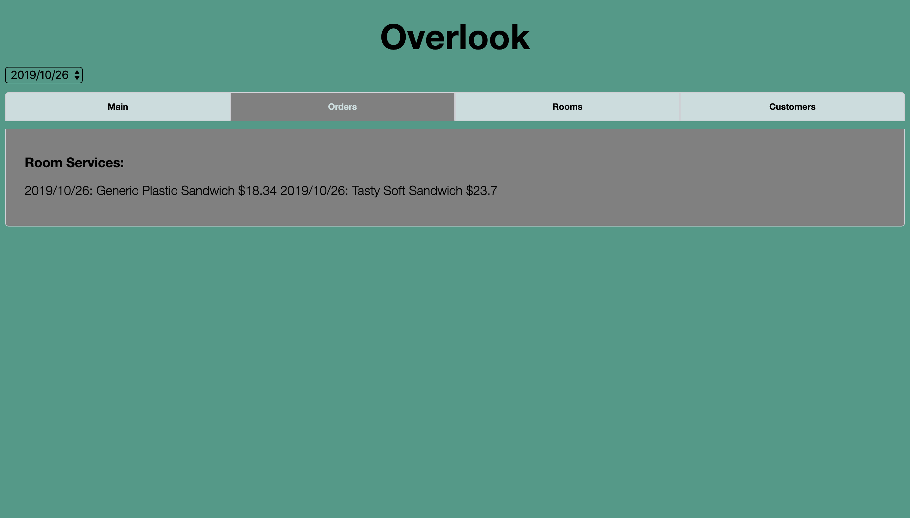
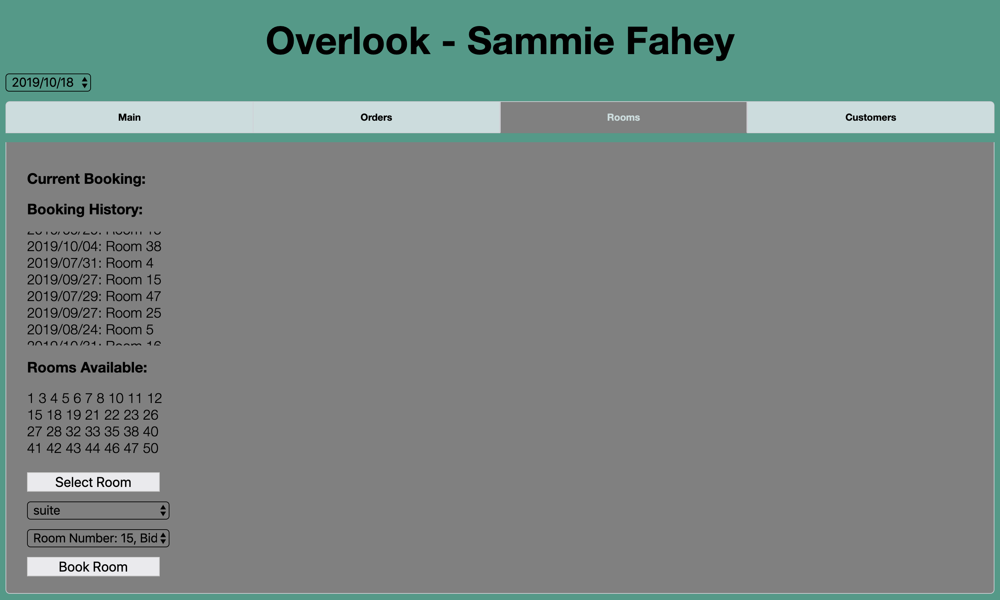
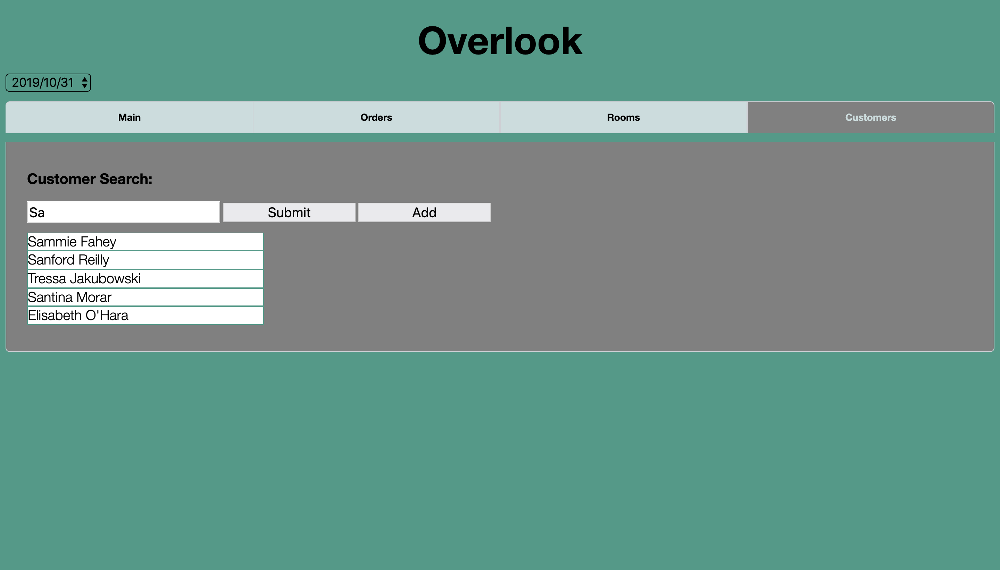

# Overlook Hotel

The Overlook project is my final solo project during Mod 2 at Turing School of Software & Design. The project is an example hotel management tool for hotel staff to manage activities like customer details, booking details for different types of rooms, unbooking rooms, and calculating/showing a customer’s total bill. It is designed for deepening my understanding of using OOP to drive the design of the application and the code, separating business-logic code from view-related code, and creating a robust test suite that thoroughly tests all functionality of a client-side application. Repository can be found <a href="https://github.com/SamuelColeman/overlook">here</a> and the project specs can be found <a href="https://frontend.turing.io/projects/overlook.html">here</a>.

## Setup

### Clone Down and Run Locally

Fork and clone down repo.

Then install the library dependencies. Run:

```bash
npm install
```

In the terminal, run:

```bash
npm start
```

You will see a bunch of lines output to your terminal. One of those lines will be something like:

Project is running at http://localhost:8080/

### Built with:

* HTML5
* CSS3
* SASS
* JavaScript
* Mocha/Chai
* JQuery
* Webpack

### Contributors

[Sam Coleman](https://github.com/SamuelColeman)

### Screenshots





